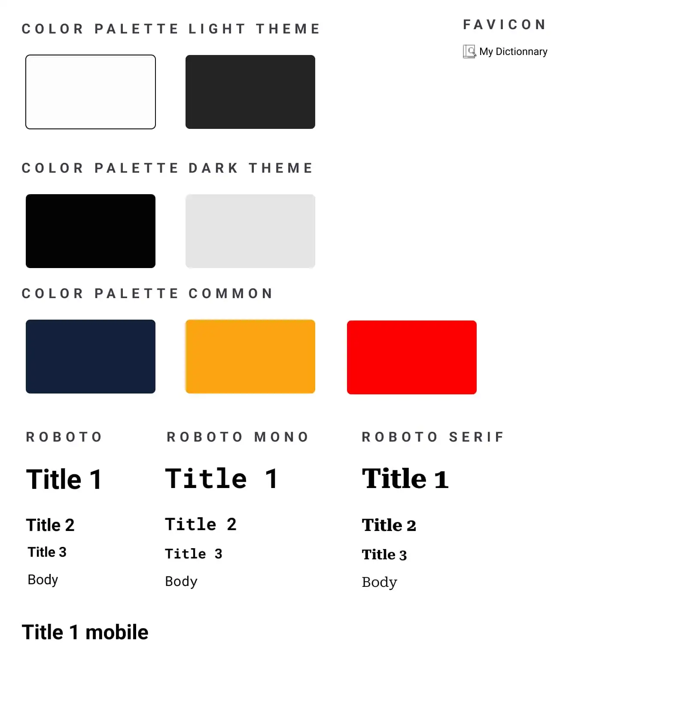
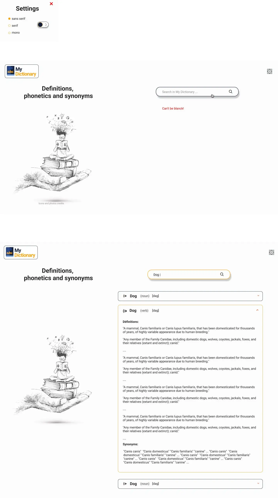
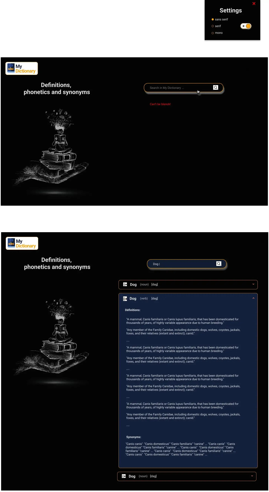
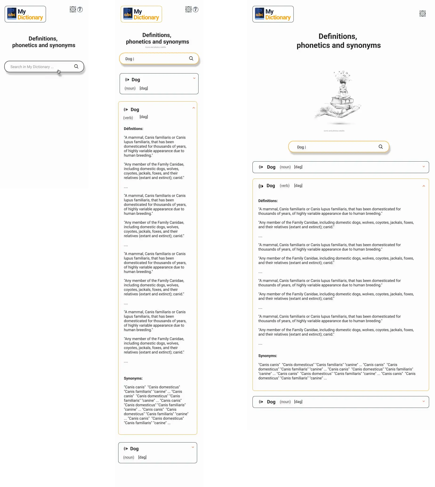
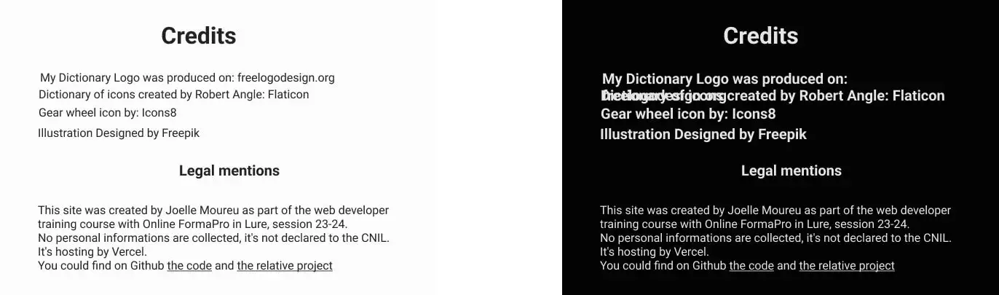

# 05-lab-js-dictionary_project

This project is an exercise for learning done during the formation with onlineformapro to become a web Developer.

In the <a href="https://github.com/JoeWebDev70/05-lab-js-dictionary">readme</a> you could find instructions on how to make it.
 

## Project description

- Modeling Figma
- webpack + optimisation modules
- Sass
- Image optimisation
- Hosting on Vercel
 

## Figma modeling

Access to <a href="https://www.figma.com/file/LtEbd6eBFJCwCmUeOtRQaj/05-lab-js-dictionary?type=design&node-id=0%3A1&mode=design&t=GZv7o9RMpYJ3DT30-1">figma</a>.

### Download the figma file
<a href="./figma/05-lab-js-dictionary.fig">05-lab-js-dictionary.fig</a>
 

### Graphic identity

 

### Desktop light

 

### Desktop dark

 

### Responsive

 

### Credits and legal mentions

 
